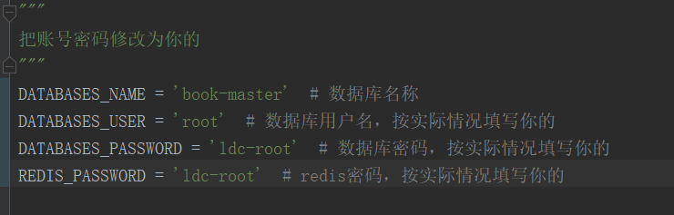
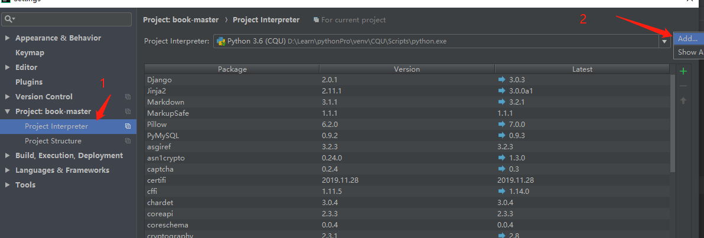
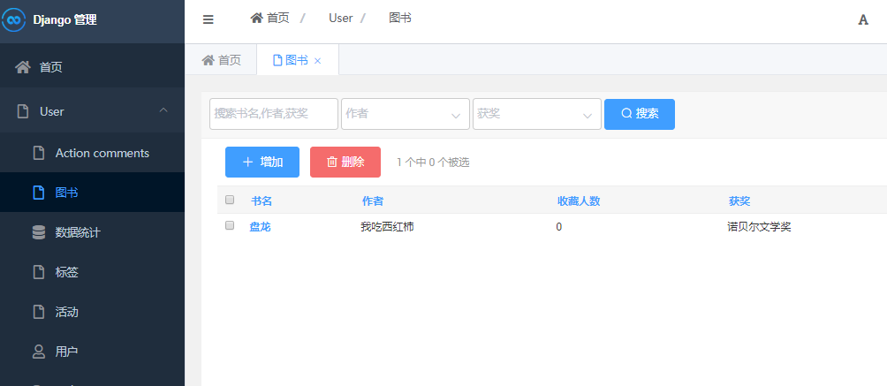
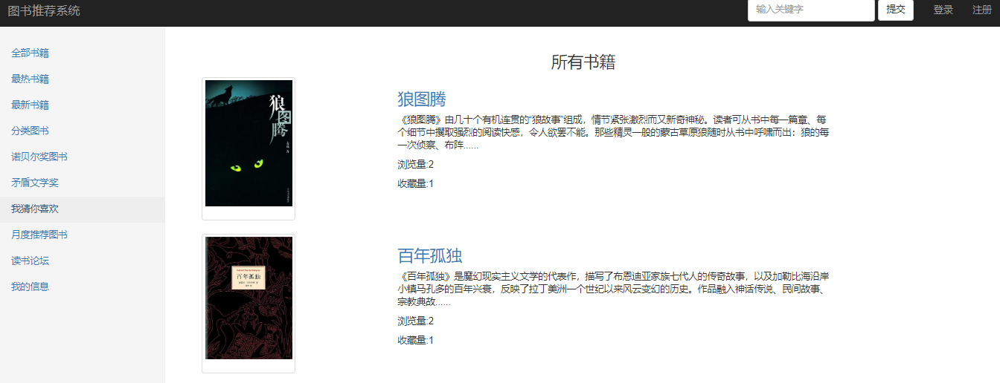
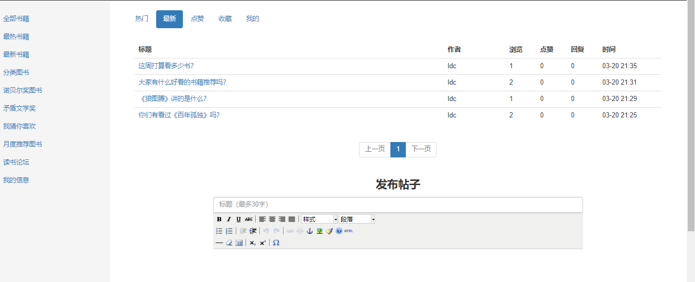
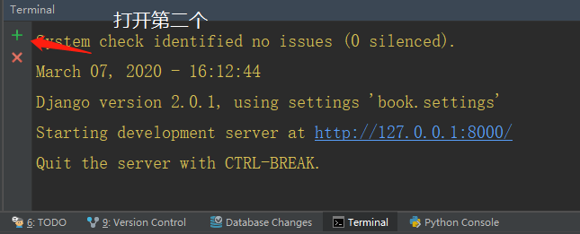

# 毕业设计--基于Django的图书推荐系统和论坛
【联系方式：微信 1257309054】


拉取项目后，启动项目步骤如下

## 1、修改book/settings.py中的数据库名称

```
先在本地mysql创建一个名为book_master的数据库
然后按以下图片所示找到相应位置，修改连接mysql的用户名与密码
```



## 2、创建虚拟环境

```
使用pycharm创建虚拟环境
打开pycharm,依次点击左上角File->settings->Project:book-master->Project Interpreter
```



## 3、安装依赖库

```
打开Pycharm左下角的Terminal
输入命令
pip install -r requirements.txt

```

## 4、创建表数据迁移

```
打开pycharm左上角的Tools->Run manage.py Task
依次输入命令
makemigrations
migrate

```

等数据迁移完成后，创建超级管理员用于登录后台管理系统

```
打开pycharm左上角的Tools->Run manage.py Task
输入命令
createsuperuser
```

## 5、上架图书

方式一：

```
打开Pycharm左下角的Terminal
输入命令
python manage.py runserver
```

然后打开浏览器

```
输入地址
http://127.0.0.1:8000/create_book/
这个是生成一些常用的书籍
下面这个是后台手动上架图书
http://127.0.0.1:8000/admin/
```




方式二：

也可以直接运行book.sql中的语句直接新增书籍。


## 6、进入用户访问界面

打开浏览器

```
输入地址
http://127.0.0.1:8000/
```

至此，整个项目运行完成


## feature

1.	登录注册页面
2.	基于协同过滤的图书的分类，排序，搜索，打分功能
3.	基于协同过滤的周推荐和月推荐

4. 读书分享会等活动功能，用户报名功能
5. 发帖留言论坛功能

6. 周推荐用户没有评分时随机推荐

7. 按照收藏数量排序


### 界面



### 注册和登录


### 推荐


### 论坛




### 周推荐


## 使用redis+celery做分布式

### 1、解压redis-64.2.8.2101.rar到D盘

然后启动redis,直接双击【启动redis.bat】

如果是解压redis到其它文件夹，则使用文本打开【启动redis.bat】，然后修改启动路径


### 2、安装第三方库

```python
pip install -r requirements.txt
```

### 3、数据库迁移

```python
打开pycharm左上角的Tools->Run manage.py Task
依次输入命令
makemigrations
migrate
```


### 4、启动项目

```python
打开Pycharm左下角的Terminal
输入命令
python manage.py runserver
```


### 5、启动celery分布式



```python
打开第二个Terminal
输入命令(可以把下面命令复制到Terminal，然后回车)
celery -A book beat -s "celery_app/celerybeat-schedule" --pidfile=

```

```python
打开第三个Terminal
输入命令(可以把下面命令复制到Terminal，然后回车)，实现对celery的监督
celery -A book worker -l debug -P eventlet
```


对celery有不懂的可以查看网站[celery](https://blog.csdn.net/lm_is_dc/article/details/82705450)


https://blog.csdn.net/lm_is_dc/article/details/82705450


## 后记

【后记】为了让大家能够轻松学编程，我创建了一个公众号【轻松学编程】，里面有让你快速学会编程的文章，当然也有一些干货提高你的编程水平，也有一些编程项目适合做一些课程设计等课题。

也可加我微信【1257309054】，拉你进群，大家一起交流学习。
如果文章对您有帮助，请我喝杯咖啡吧！

公众号


关注我，我们一起成长~~
