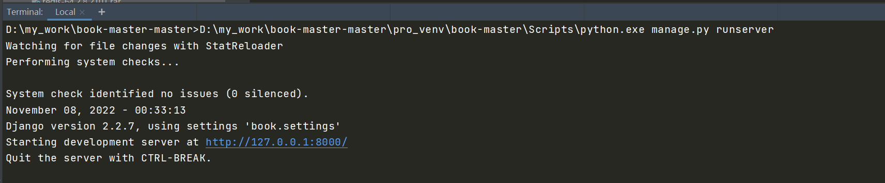

# 毕业设计--基于Django的图书推荐系统和论坛
【**联系方式：微信 1257309054**】


### 注意

**如果有图片显示问题，可以下载`readme.pdf`查看。**


### 具体功能

【开源版】：

登录、注册、搜索、全部书籍、热门书籍、上市新书、点赞、评论、收藏、论坛、个人中心

图书：200册

【精装版】

登录、注册、搜索、全部书籍、热门书籍、上市新书、图书分类、猜你喜欢、点赞、评论、收藏、购买书籍、购物车、立即支付、图书借阅、个人中心、物流状态。

图书：10000册，带爬虫代码

注册使用选择喜欢的图书类型解决热启动的问题。

网址[http://newbook.qsxbc.com](http://newbook.qsxbc.com/all_book/)

### demo

[成品效果点我展示demo1传送门](http://book.qsxbc.com/ )

[成品效果点我展示demo2传送门](http://newbook.qsxbc.com/)

[详细讲解传送门](https://liangdongchang.blog.csdn.net/article/details/124071363)


### 其他推荐系统

电影推荐系统、在线选修课推荐系统、健康知识推荐系统。


demo上线购物车功能、购物清单、立即支付、添加购物车、查看已支付、待收货、已收货功能。

demo上线借阅图书功能。

demo增加基于物品推荐协同过滤功能。


拉取项目后，启动项目步骤如下。


## 1、安装python

**注意**：python解析器最好使用**3.6.6**版本的。

双击本目录下的`python3.6.6.exe`,如下图安装：

1、选择customize,最好也勾选`Add python3.6toPATH`


2、点击next

3、选择for all users


4、选择继续即可，安装成功如下：


### 

## 2、拉取项目，创建虚拟环境

在D盘创建一个文件夹`my_work`，把从gitee拉取的项目直接解压到当前文件夹下：如图所示：


解压`pro_venv`中的虚拟环境`book_master`到该目录下：


## 3、修改book/settings.py中的数据库名称

```
先在本地mysql创建一个名为book_master的数据库
然后按以下图片所示找到相应位置，修改连接mysql的用户名与密码
```


## 4、数据迁移

### 4.1 创建表

打开Pycharm左下角的Terminal：


使用命令：

```
D:\my_work\book-master-master\pro_venv\book-master\Scripts\python.exe manage.py migrate
```


### 4.2 创建缓存表

```
D:\my_work\book-master-master\pro_venv\book-master\Scripts\python.exe manage.py createcachetable
```


### 4.3 创建超级管理员

等数据迁移完成后，创建超级管理员用于登录后台管理系统：

```
D:\my_work\book-master-master\pro_venv\book-master\Scripts\python.exe manage.py createsuperuser
```

设置超级管理员账号【root】，密码【book-root】后面登录时需要用到。


## 5、启动项目

打开Pycharm左下角的Terminal，输入命令：

```
D:\my_work\book-master-master\pro_venv\book-master\Scripts\python.exe manage.py runserver
```




## 6、上架图书

然后打开谷歌浏览器，输入地址：

```
http://127.0.0.1:8000/create_book/
这个是生成一些常用的书籍
下面这个是后台手动上架图书
http://127.0.0.1:8000/admin/
```


## 7、进入用户访问界面

打开浏览器，输入地址:

```
http://127.0.0.1:8000/
```


至此，整个项目运行完成


## 8、进入后台管理界面

打开浏览器，输入地址：

```
http://127.0.0.1:8000/admin/
```

输入账号：root

密码：book-root

即可登录。


## feature

1.	登录注册页面
	.	基于协同过滤的图书的分类，排序，搜索，打分功能
	.	基于协同过滤的周推荐和月推荐

4. 读书分享会等活动功能，用户报名功能
5. 发帖留言论坛功能

6. 周推荐用户没有评分时随机推荐

7. 按照收藏数量排序


### 界面


### 注册和登录


### 推荐


### 论坛


### 周推荐


## 扩展：使用redis+celery做分布式

### 1、解压redis-64.2.8.2101.rar到D盘

然后启动redis,直接双击【启动redis.bat】

如果是解压redis到其它文件夹，则使用文本打开【启动redis.bat】，然后修改启动路径


### 2、安装第三方库

```python
pip install -r requirements.txt
```

### 3、数据库迁移

```python
打开pycharm左上角的Tools->Run manage.py Task
依次输入命令
makemigrations
migrate
```


### 4、启动项目

```python
打开Pycharm左下角的Terminal
输入命令
python manage.py runserver
```


### 5、启动celery分布式


```python
打开第二个Terminal
输入命令(可以把下面命令复制到Terminal，然后回车)
celery -A book beat -s "celery_app/celerybeat-schedule" --pidfile=

```

```python
打开第三个Terminal
输入命令(可以把下面命令复制到Terminal，然后回车)，实现对celery的监督
celery -A book worker -l debug -P eventlet
```


对celery有不懂的可以查看网站[celery](https://blog.csdn.net/lm_is_dc/article/details/82705450)


https://blog.csdn.net/lm_is_dc/article/details/82705450


## 后记

【后记】为了让大家能够轻松学编程，我创建了一个公众号【轻松学编程】，里面有让你快速学会编程的文章，当然也有一些干货提高你的编程水平，也有一些编程项目适合做一些课程设计等课题。

也可加我微信【1257309054】，拉你进群，大家一起交流学习。
如果文章对您有帮助，请我喝杯咖啡吧！

公众号


关注我，我们一起成长~~
